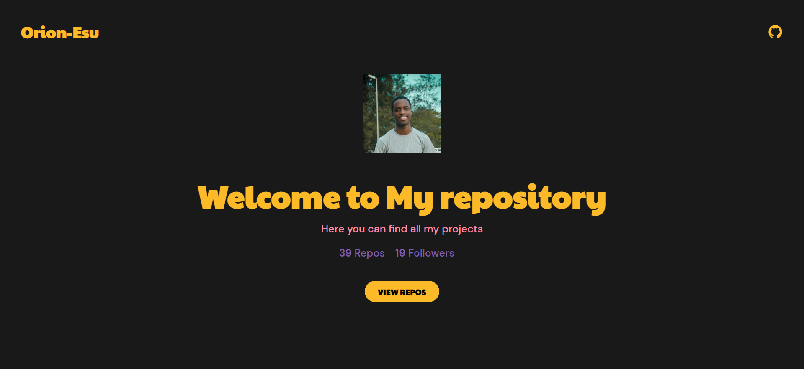

# Halo Task Project

A React Js project showcasing my Github Repositories.

[Orion Esu](https://altschool-orion-esu.vercel.app/)

## Screenshot of Dashboard

## Tech Used
* React Js V18
* React Router v6
* SASS
* React Icons Package

## Lessons Learned
This is my first React Js Project.
* I solidified my understanding of the useState and useEffect Hooks.
* I learned how to make request from API and pass it as state 
* Using Icons in React Projects

## Future Release
I would love to restructure the CSS and add some animations to the UI. Some implementations i carried out felt hacky and I think there may be better ways of doing them.

## Setting Up
### npm install
To install the dependencies from the package.json

### npm start
TO start the application in localhost